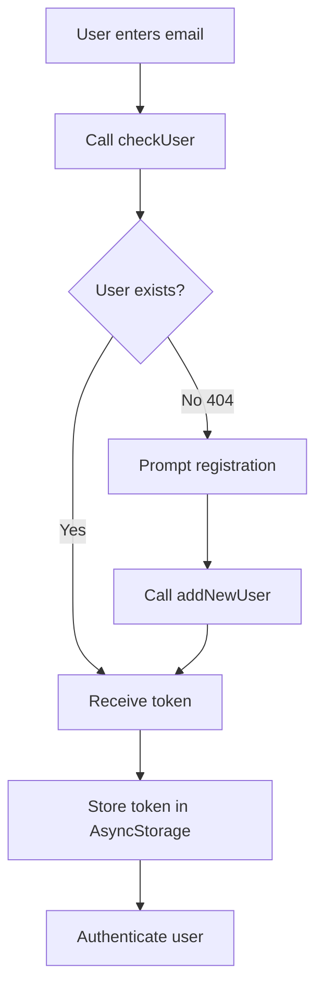

## Overview

The authentication API handles user registration, login, and token validation. All functions are defined in `src/services/user.ts`.

## checkUser()

Checks if a user exists and returns their authentication token.

### Function Signature

```typescript
export async function checkUser(email: string)
```

### Parameters

<ParamField path="email" type="string" required>
  The user's email address to check
</ParamField>

### Returns

<ResponseField name="token" type="string">
  JWT authentication token for the user
</ResponseField>

### Example Usage

<CodeGroup>

```typescript Login Flow
import { checkUser } from '@/services/user';
import { useAuthStore } from '@/store/AuthStore';

const { authenticate } = useAuthStore();
const email = "user@example.com";

try {
  const { token } = await checkUser(email);
  authenticate(token);
} catch (error) {
  if (error?.message?.includes('404')) {
    // User not found - prompt for registration
    console.log("Email not found");
  } else {
    console.log("Login error: ", error);
  }
}
```

```typescript From LoginForm Component
// src/components/auth/LoginForm.tsx
async function handleLogin() {
  if (!email?.length) {
    alert("Empty data", "Please, enter a email");
    return;
  }
  try {
    const { token } = await checkUser(email);
    authenticate(token);
  } catch (error) {
    if(error?.message?.includes('404')) {
      alert(
        "Attention please!", 
        "Email not found, Would you like to registry this email?"
      );
      return;
    }
    alert("Attention please!", "There's an error");
  }
}
```

</CodeGroup>

### HTTP Request

```http
GET /users/{email}
```

<Info>
  Returns 404 if the user doesn't exist. The app uses this to determine whether to register a new user.
</Info>

---

## addNewUser()

Registers a new user with the provided email address.

### Function Signature

```typescript
export async function addNewUser(email: string)
```

### Parameters

<ParamField path="email" type="string" required>
  The email address for the new user account
</ParamField>

### Returns

<ResponseField name="token" type="string">
  JWT authentication token for the newly created user
</ResponseField>

### Example Usage

<CodeGroup>

```typescript New User Registration
import { addNewUser } from '@/services/user';
import { useAuthStore } from '@/store/AuthStore';

const { authenticate } = useAuthStore();
const email = "newuser@example.com";

try {
  const { token } = await addNewUser(email);
  authenticate(token);
  console.log("User registered successfully");
} catch (error) {
  console.log("Registration error: ", error);
}
```

```typescript Registration Handler
// From LoginForm.tsx:49
async function handleNewRegistry() {
  try {
    const { token } = await addNewUser(email);
    authenticate(token);
  } catch (error) {
    alert("Attention please!", "There's an error, please try again");
    console.log("error to registry new user: ", error);
  }   
}
```

</CodeGroup>

### HTTP Request

```http
POST /users
Content-Type: application/json

{
  "email": "user@example.com"
}
```

<Warning>
  This endpoint creates a new user account. Ensure email validation is performed before calling this function.
</Warning>

---

## validateToken()

Validates an authentication token to verify it's still valid.

### Function Signature

```typescript
export async function validateToken(token: string)
```

### Parameters

<ParamField path="token" type="string" required>
  The JWT token to validate
</ParamField>

### Returns

<ResponseField name="data" type="object">
  Validation result indicating whether the token is valid
</ResponseField>

### Example Usage

```typescript Token Validation
import { validateToken } from '@/services/user';
import AsyncStorage from '@react-native-async-storage/async-storage';

try {
  const token = await AsyncStorage.getItem('token');
  if (token) {
    const result = await validateToken(token);
    console.log("Token is valid", result);
  }
} catch (error) {
  console.log("Token validation failed: ", error);
  // Redirect to login
}
```

### HTTP Request

```http
POST /users/validate-token
Content-Type: application/json

{
  "token": "eyJhbGciOiJIUzI1NiIsInR5cCI6IkpXVCJ9..."
}
```

<Tip>
  Use this endpoint on app startup to check if the stored token is still valid before allowing access to protected screens.
</Tip>

## Authentication Flow

The typical authentication flow in the app:



## Token Storage

Tokens are automatically stored and retrieved from AsyncStorage:

```typescript
import AsyncStorage from '@react-native-async-storage/async-storage';

// Store token
await AsyncStorage.setItem('token', token);

// Retrieve token (handled automatically by axios interceptor)
const token = await AsyncStorage.getItem('token');
```

<Info>
  The axios interceptor in `src/client/axios.ts` automatically attaches tokens to all API requests, so you don't need to manually include them.
</Info>