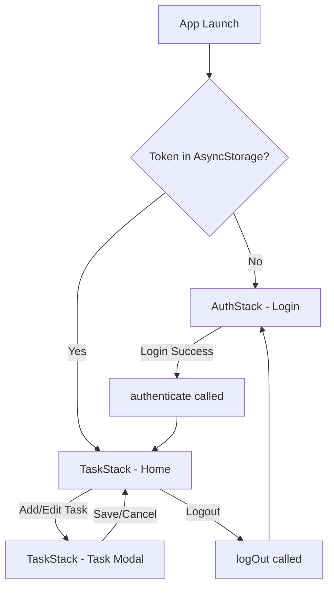

## Overview

The app uses **React Navigation v7** with native stack navigators for iOS and Android navigation patterns.

Navigation is split into two stacks:
- **AuthStack** - Pre-authentication screens (login)
- **TaskStack** - Post-authentication screens (home, task modal)

## Navigation Container

The root navigator conditionally renders stacks based on authentication state:

```typescript App.tsx:44-54
<NavigationContainer>
  {!isAuth ? (
    <AuthStack />
  ) : (
    <TaskStack />
  )}
</NavigationContainer>
```

<Info>
  When `isAuth` changes from `false` to `true`, React Navigation automatically transitions from AuthStack to TaskStack
</Info>

## AuthStack

Simple stack for unauthenticated users with a single login screen.

<CodeGroup>
```typescript src/stacks/AuthStack.tsx
import LoginScreen from '@/screens/LoginScreen';
import { createNativeStackNavigator } from '@react-navigation/native-stack';
import { StatusBar } from 'expo-status-bar';

function AuthStack() {
    const Stack = createNativeStackNavigator();

    return (
        <>
            <StatusBar style='light' />
            <Stack.Navigator screenOptions={{ headerShown: false }}>
                <Stack.Screen name='Login' component={LoginScreen} />
            </Stack.Navigator>
        </>
    )
}

export default AuthStack;
```
</CodeGroup>

### Configuration

- **headerShown: false** - Hides the navigation header on login screen (`AuthStack.tsx:11`)
- **StatusBar style='light'** - Sets light status bar for dark backgrounds (`AuthStack.tsx:10`)

## TaskStack

Main navigation stack with home screen and modal task editor.

<CodeGroup>
```typescript src/stacks/TaskStack.tsx
import TaskRightHeader from "@/components/task/TaskRightHeader";
import HomeScreen from "@/screens/HomeScreen";
import TaskScreen from "@/screens/TaskScreen";
import { appFonts } from "@/utils/fonts";
import { createNativeStackNavigator } from "@react-navigation/native-stack";

function TaskStack() {
    const Stack = createNativeStackNavigator();

    return (
        <Stack.Navigator screenOptions={{
            headerTitleStyle: {
              fontFamily: appFonts?.title,
            },
        }}>
            <Stack.Group>
                <Stack.Screen 
                    name="Home"
                    component={HomeScreen}
                    options={{
                        headerTitle: 'The Go Game Todo App',
                        headerRight: () => <TaskRightHeader />
                    }}
                />
            </Stack.Group>
            <Stack.Group screenOptions={{presentation: 'modal'}}>
                <Stack.Screen name='Task' component={TaskScreen} />
            </Stack.Group>
        </Stack.Navigator>
    )
}

export default TaskStack;
```
</CodeGroup>

### Screen Groups

<Tabs>
  <Tab title="Main Group">
    Regular stack screens with standard navigation transitions.

    - **Home** - Task list screen with custom header title and logout button (`TaskStack.tsx:17-24`)
    - Custom header font applied via `headerTitleStyle` (`TaskStack.tsx:12-13`)
  </Tab>
  <Tab title="Modal Group">
    Screens presented as modals from bottom of screen.

    - **Task** - Add/edit task screen with modal presentation (`TaskStack.tsx:26-28`)
    - Modal presentation for iOS-style bottom sheet behavior
  </Tab>
</Tabs>

### Custom Header Components

The Home screen includes a custom right header button:

```typescript TaskStack.tsx:22
headerRight: () => <TaskRightHeader />
```

This component (`TaskRightHeader`) likely contains the logout functionality and add task button.

## Navigation Types

TypeScript navigation types are defined in `src/types/navigation.ts`:

```typescript src/types/navigation.ts
import { NativeStackNavigationProp } from "@react-navigation/native-stack";

type StackParamList = {
    Home: undefined;
    Task: undefined;
};

export type NavigationProp = NativeStackNavigationProp<StackParamList>;
```

<Note>
  Both screens accept `undefined` as params, meaning they don't require navigation parameters. Task editing is likely handled through Zustand store state rather than route params.
</Note>

## Usage in Components

Screens access navigation using the typed hook:

```typescript
import { useNavigation } from '@react-navigation/native';
import { NavigationProp } from '@/types/navigation';

function MyComponent() {
  const navigation = useNavigation<NavigationProp>();
  
  const openTaskModal = () => {
    navigation.navigate('Task');
  };
}
```

## Navigation Flow



## Key Features

- **Persistent authentication** - Token stored in AsyncStorage survives app restarts
- **Modal presentation** - Task screen appears as bottom sheet modal
- **Custom fonts** - Header titles use app-specific fonts from `@/utils/fonts`
- **Type safety** - Full TypeScript support for navigation params and props
