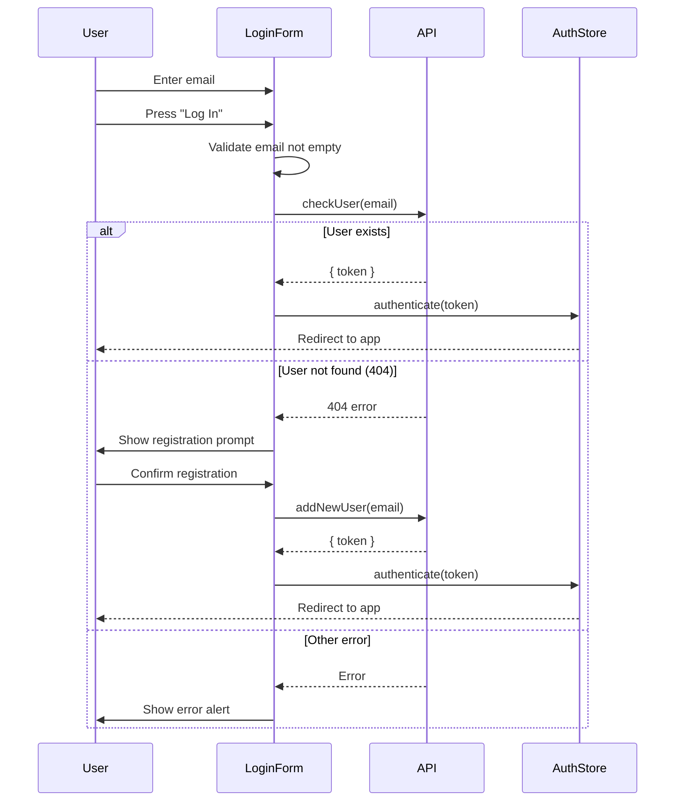
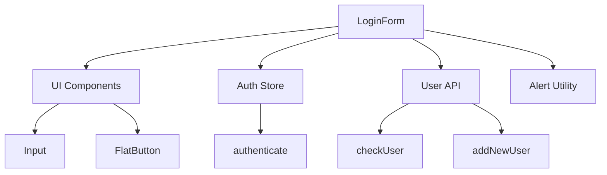

## Overview

Authentication components handle user login and automatic registration for The Go Game Todo App. The app uses email-based authentication with token storage.

## LoginForm

Email-based login form with automatic user registration.

**Location**: `src/components/auth/LoginForm.tsx`

### Props

No props required. The component manages its own state and integrates with the auth store.

### Usage Example

```tsx
import LoginForm from '@/components/auth/LoginForm';

function LoginScreen() {
  return (
    <View style={styles.container}>
      <LoginForm />
    </View>
  );
}
```

### Features

<Tabs>
  <Tab title="Email Login">
    **Email Input Field**:
    ```tsx
    <Input
      label='Email'
      textInputConfig={{
        placeholder: 'Enter an email',
        value: email,
        onChangeText: setEmail?.bind(this)
      }}
    />
    ```
    
    From LoginForm.tsx:61-68
    
    - Single email input field
    - Validates email is not empty
    - Shows error alert if empty
  </Tab>
  
  <Tab title="Auto Registration">
    **Automatic User Creation**:
    
    When email is not found (404 error), prompts user to register:
    
    ```typescript
    if(error?.message?.includes('404')) {
      alert(
        "Attention please!", 
        "Email not found, Would you like to registry this email for future sessions?",
        [
          {
            text: 'No',
            style: 'cancel',
            onPress: () => {},
          },
          {
            text: 'Yes',
            onPress: handleNewRegistry,
            style: 'default',
          },
        ],
      );
      return;
    }
    ```
    
    From LoginForm.tsx:24-41
  </Tab>
  
  <Tab title="Token Authentication">
    **Token Storage**:
    
    After successful login or registration, stores auth token:
    
    ```typescript
    // Login
    const { token } = await checkUser(email);
    authenticate(token);
    
    // Registration
    const { token } = await addNewUser(email);
    authenticate(token);
    ```
    
    The `authenticate` function from auth store saves the token for future API requests.
  </Tab>
</Tabs>

### State Management

**Local State**:
```typescript
const [email, setEmail] = useState<string>('');
```

**Auth Store Integration**:
```typescript
const { authenticate } = useAuthStore();
```

### API Integration

The component integrates with two API services:

<Accordion title="checkUser">
  **Login Existing User**:
  
  ```typescript
  import { checkUser } from '@/services/user';
  
  async function handleLogin() {
    if (!email?.length) {
      alert("Empty data", "Please, enter a email");
      return;
    }
    try {
      const { token } = await checkUser(email);
      authenticate(token);
    } catch (error) {
      // Handle 404 or other errors
    }
  }
  ```
  
  From LoginForm.tsx:15-47
  
  **Returns**: `{ token: string }`
  
  **Throws**: 404 error if email not found
</Accordion>

<Accordion title="addNewUser">
  **Register New User**:
  
  ```typescript
  import { addNewUser } from '@/services/user';
  
  async function handleNewRegistry() {
    try {
      const { token } = await addNewUser(email);
      authenticate(token);
    } catch (error) {
      alert("Attention please!", "There's an error, please try again again");
      console.log("error to registry new user: ", error);
    }   
  }
  ```
  
  From LoginForm.tsx:49-57
  
  **Returns**: `{ token: string }`
  
  **Auto-called**: When user confirms registration dialog
</Accordion>

### Error Handling

The component implements comprehensive error handling:

<Card title="Empty Email Validation" icon="circle-exclamation">
  ```typescript
  if (!email?.length) {
    alert("Empty data", "Please, enter a email");
    return;
  }
  ```
  
  Prevents submission if email field is empty.
</Card>

<Card title="User Not Found (404)" icon="user-slash">
  ```typescript
  if(error?.message?.includes('404')) {
    alert(
      "Attention please!", 
      "Email not found, Would you like to registry this email?",
      [
        { text: 'No', style: 'cancel' },
        { text: 'Yes', onPress: handleNewRegistry },
      ],
    );
    return;
  }
  ```
  
  Prompts user to create new account when email not found.
</Card>

<Card title="General Login Errors" icon="triangle-exclamation">
  ```typescript
  alert(
    "Attention please!", 
    "There's an error, please check the email and try again"
  );
  console.log("error login: ", error);
  ```
  
  Catches and displays any other login errors.
</Card>

<Card title="Registration Errors" icon="xmark">
  ```typescript
  alert(
    "Attention please!", 
    "There's an error, please try again again"
  );
  console.log("error to registry new user: ", error);
  ```
  
  Handles errors during user registration.
</Card>

### Layout Structure

```tsx
<View style={styles.rootContainer}>
  {/* Email Input */}
  <Input
    label='Email'
    textInputConfig={{
      placeholder: 'Enter an email',
      value: email,
      onChangeText: setEmail?.bind(this)
    }}
  />
  
  {/* Login Button */}
  <View style={styles.buttonContainer}>
    <FlatButton onPress={handleLogin}>
      Log In
    </FlatButton>
  </View>
</View>
```

### Styling

```typescript
const styles = StyleSheet.create({
  rootContainer: {
    ...GlobalStyles?.card,  // Uses global card styling
  },
  buttonContainer: {
    justifyContent: 'center',
    alignItems: 'center',
  }
});
```

The form uses `GlobalStyles.card` for consistent card appearance with other forms in the app.

## Authentication Flow



## Component Dependencies



## Integration with Auth Store

The LoginForm integrates with Zustand's auth store:

```typescript
import { useAuthStore } from '@/store/AuthStore';

const { authenticate } = useAuthStore();
```

**authenticate Function**:
- Stores authentication token
- Updates app-wide auth state
- Triggers navigation to authenticated screens

## Best Practices

<Card title="Email Validation" icon="envelope-circle-check">
  Always validate email before API calls:
  
  ```typescript
  if (!email?.length) {
    alert("Empty data", "Please, enter a email");
    return;
  }
  ```
</Card>

<Card title="User-Friendly Registration" icon="user-plus">
  Prompt users to register when email not found:
  
  ```typescript
  alert(
    "Attention please!", 
    "Email not found, Would you like to registry this email?",
    [
      { text: 'No', style: 'cancel' },
      { text: 'Yes', onPress: handleNewRegistry },
    ],
  );
  ```
  
  This creates a seamless onboarding experience.
</Card>

<Card title="Error Logging" icon="bug">
  Always log errors for debugging:
  
  ```typescript
  catch (error) {
    alert("Attention please!", "There's an error...");
    console.log("error login: ", error);
  }
  ```
</Card>

<Card title="Token Security" icon="lock">
  Never log or display authentication tokens:
  
  ```typescript
  // Good
  const { token } = await checkUser(email);
  authenticate(token);
  
  // Bad - never do this
  console.log('Token:', token);
  alert('Your token is: ' + token);
  ```
</Card>

## Future Enhancements

Potential improvements for the authentication system:

- Email format validation (regex)
- Password-based authentication
- Social login (Google, Apple)
- Biometric authentication (Touch ID, Face ID)
- Token refresh mechanism
- "Remember me" functionality
- Password reset flow