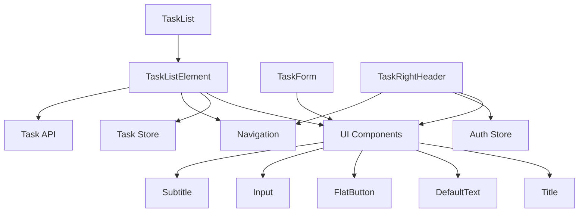

## Overview

Task components handle the core todo functionality of The Go Game Todo App. They integrate with Zustand state management, React Navigation, and backend API services.

## TaskForm

Form component for creating new tasks or editing existing ones.

**Location**: `src/components/task/TaskForm.tsx`

### Props

<ParamField path="onSubmit" type="(data: Partial<Task>) => void" required>
  Callback function executed when form is submitted with task data
</ParamField>

<ParamField path="isEdit" type="boolean">
  Whether the form is in edit mode (changes button text and pre-fills data)
</ParamField>

<ParamField path="selectedTask" type="Partial<Task>">
  Task data to pre-fill when editing (requires `isEdit` to be true)
</ParamField>

### Usage Examples

<Tabs>
  <Tab title="Create New Task">
    ```tsx
    import TaskForm from '@/components/task/TaskForm';

    function CreateTaskScreen() {
      async function handleSubmit(data: Partial<Task>) {
        // Create new task
        const newTask = await createTask(data);
        console.log('Created:', newTask);
      }

      return <TaskForm onSubmit={handleSubmit} />;
    }
    ```
  </Tab>
  
  <Tab title="Edit Existing Task">
    ```tsx
    import TaskForm from '@/components/task/TaskForm';

    function EditTaskScreen({ route }) {
      const task = route.params.task;
      
      async function handleSubmit(data: Partial<Task>) {
        // Update existing task
        await updateTask(task.id, data);
      }

      return (
        <TaskForm 
          onSubmit={handleSubmit}
          isEdit={true}
          selectedTask={task}
        />
      );
    }
    ```
  </Tab>
</Tabs>

### Features

- **State Management**: Uses local state to track form inputs
- **Pre-filling**: Automatically populates fields when editing
- **Validation**: Title and description inputs
- **Dynamic Button**: Shows "Create new task" or "Save changes" based on mode

### Form Fields

<Accordion title="Title Field">
  ```tsx
  <Input 
    label="Title"
    textInputConfig={{
      value: inputData.title,
      onChangeText: handleInputChange.bind(this, 'title'),
    }}
  />
  ```
  
  Single-line text input for task title (from TaskForm.tsx:35-41)
</Accordion>

<Accordion title="Description Field">
  ```tsx
  <Input 
    label="Description" 
    textInputConfig={{
      multiline: true,
      autoCapitalize: 'sentences',
      value: inputData.description,
      onChangeText: handleInputChange.bind(this, 'description'),
    }} 
  />
  ```
  
  Multiline text input for task description (from TaskForm.tsx:42-49)
</Accordion>

### Implementation Details

**State Structure**:
```typescript
const [inputData, setInputData] = useState<Partial<Task>>({
  title: isEdit ? selectedTask?.title : "",
  description: isEdit ? selectedTask?.description : "",
});
```

**Input Handler**:
```typescript
function handleInputChange(inputIdentifier: string, enteredValue: string) {
  setInputData((currentValues) => ({
    ...currentValues,
    [inputIdentifier]: enteredValue,
  }));
}
```

---

## TaskList

Scrollable list container that renders multiple tasks.

**Location**: `src/components/task/TaskList.tsx`

### Props

<ParamField path="tasks" type="Task[]" required>
  Array of task objects to display
</ParamField>

### Usage Example

```tsx
import TaskList from '@/components/task/TaskList';
import { useTaskStore } from '@/store/TaskState';

function TasksScreen() {
  const { tasks } = useTaskStore();
  
  return <TaskList tasks={tasks} />;
}
```

### Implementation Details

Uses React Native's `FlatList` for optimized rendering:

```tsx
<FlatList
  data={tasks}
  renderItem={renderItemElement}
  keyExtractor={(item) => item?.id}
/>
```

**Render Function**:
```typescript
function renderItemElement(itemData: any) {
  return <TaskListElement {...itemData?.item} />
}
```

Each task is rendered using `TaskListElement` with all task properties spread as props.

---

## TaskListElement

Individual task card with status toggle, edit, and delete actions.

**Location**: `src/components/task/TaskListElement.tsx`

### Props

Accepts `Partial<Task>` properties:

<ParamField path="id" type="string">
  Unique task identifier
</ParamField>

<ParamField path="title" type="string">
  Task title text
</ParamField>

<ParamField path="description" type="string">
  Task description text
</ParamField>

<ParamField path="createdAt" type="Date">
  Task creation timestamp
</ParamField>

<ParamField path="status" type="string">
  Task status: 'pending' or 'completed'
</ParamField>

### Features

<Tabs>
  <Tab title="Status Toggle">
    **Dynamic Status Badge**:
    ```tsx
    <FlatButton 
      onPress={toggleStatus}
      style={{
        pressableContainer: {
          backgroundColor: status == 'pending' 
            ? GlobalColors.warning 
            : GlobalColors.success,
          paddingHorizontal: 20,
          paddingVertical: 10,
        },
        text: { 
          color: status == 'pending' 
            ? GlobalColors.darkText 
            : GlobalColors.lightText 
        },
      }}
    >
      {status}
    </FlatButton>
    ```
    
    From TaskListElement.tsx:93-101
    
    - Pending: Orange background, dark text
    - Completed: Green background, light text
  </Tab>
  
  <Tab title="Edit Action">
    **Edit Button**:
    ```tsx
    <FlatButton onPress={editHandler}>
      <Ionicons 
        name="pencil" 
        size={24} 
        color={GlobalColors.darkBackground} 
      />
    </FlatButton>
    ```
    
    Navigates to Task screen with taskId parameter:
    ```typescript
    function editHandler() {
      navigation.navigate('Task', {
        taskId: id!,
      });
    }
    ```
  </Tab>
  
  <Tab title="Delete Action">
    **Delete with Confirmation**:
    ```tsx
    <FlatButton onPress={deleteHandler}>
      <Ionicons 
        name="trash" 
        size={24} 
        color={GlobalColors.error}
      />
    </FlatButton>
    ```
    
    Shows confirmation alert before deletion:
    ```typescript
    function deleteHandler() {
      alert(
        "Warning!", 
        "Would you like to delete this task?",
        [
          {
            text: 'Cancel',
            style: 'cancel',
            onPress: () => {},
          },
          {
            text: 'Yes, Do it!',
            onPress: () => deleteAction(),
            style: 'default',
          },
        ],
      );
    }
    ```
    
    From TaskListElement.tsx:34-51
  </Tab>
</Tabs>

### State Management

Integrates with Zustand task store:

```typescript
const { deleteTask: deleteCurrentTask, toggleTaskStatus } = useTaskStore();
```

**Toggle Status**:
```typescript
async function toggleStatus() {
  try {
    const { status } = await changeStatus(id!);
    toggleTaskStatus(id!, status);
  } catch (error) {
    alert("Attention please!", `The task ${title} status could not changed`);
    console.log("Error to toggle task status: ", error);
  }
}
```

**Delete Task**:
```typescript
async function deleteAction() {
  try {
    await deleteTask(id!);
    deleteCurrentTask(id!);
    alert("Well done", `The task ${title} has been deleted successfully!`);   
  } catch (error) {
    alert("Attention please!", `The task ${title} could not be deleted`);
    console.log("Error deleting task: ", error);
  }
}
```

### Layout Structure

```tsx
<View style={styles.rootContainer}>
  {/* Title */}
  <View style={styles.titleContainer}>
    <Title>{title}</Title>
  </View>
  
  {/* Description */}
  <View style={styles.descriptionContainer}>
    <DefaultText>{description}</DefaultText>
  </View>
  
  {/* Creation Date */}
  <View>
    <Subtitle style={styles.date}>
      <Ionicons name='calendar-outline' size={12} /> {getFormattedDate(createdAt!)}
    </Subtitle>
  </View>
  
  {/* Footer with Actions */}
  <View style={styles.FooterContainer}>
    <View>
      {/* Status Badge */}
    </View>
    <View style={styles.buttonsContainer}>
      {/* Edit and Delete Buttons */}
    </View>
  </View>
</View>
```

---

## TaskRightHeader

Header component with "Add Task" and "Logout" buttons.

**Location**: `src/components/task/TaskRightHeader.tsx`

### Props

No props required.

### Usage Example

```tsx
import TaskRightHeader from '@/components/task/TaskRightHeader';

<Stack.Screen 
  name="Tasks" 
  component={TasksScreen}
  options={{
    headerRight: () => <TaskRightHeader />
  }}
/>
```

### Features

<Tabs>
  <Tab title="Add Task Button">
    ```tsx
    <FlatButton 
      onPress={() => navigation.navigate('Task')}
    >
      <Ionicons name='add-circle-outline' color="black" size={36} />
    </FlatButton>
    ```
    
    Navigates to Task screen (create mode) when pressed.
  </Tab>
  
  <Tab title="Logout Button">
    ```tsx
    <FlatButton 
      onPress={logOut}
    >
      <Ionicons name='log-out-outline' color="black" size={36} />
    </FlatButton>
    ```
    
    Calls `logOut` from auth store to sign out the user.
  </Tab>
</Tabs>

### State Management

```typescript
const { logOut } = useAuthStore();
```

### Styling

```typescript
const styles = StyleSheet.create({
  container: {
    flexDirection: 'row',
    justifyContent: 'flex-end',
    gap: 5,
  }
});
```

Buttons are displayed horizontally with 5px gap.

---

## Task Interface

All task components use the `Task` interface:

```typescript
// From @/interfaces/task.ts
export interface Task {
  id: string;
  title: string;
  description: string;
  createdAt: Date;
  status: string;
  userId: string;
}
```

## Component Dependencies



## Best Practices

<Card title="Error Handling" icon="shield-check">
  Task components implement comprehensive error handling:
  
  ```typescript
  try {
    await deleteTask(id!);
    deleteCurrentTask(id!);
    alert("Well done", `Task deleted successfully!`);
  } catch (error) {
    alert("Attention please!", `Could not delete task`);
    console.log("Error deleting task: ", error);
  }
  ```
</Card>

<Card title="User Confirmation" icon="circle-question">
  Destructive actions require user confirmation:
  
  ```typescript
  alert(
    "Warning!", 
    "Would you like to delete this task?",
    [
      { text: 'Cancel', style: 'cancel' },
      { text: 'Yes, Do it!', onPress: deleteAction },
    ],
  );
  ```
</Card>

<Card title="State Synchronization" icon="rotate">
  Components sync local and server state:
  
  ```typescript
  // 1. Update server
  const { status } = await changeStatus(id!);
  
  // 2. Update local store
  toggleTaskStatus(id!, status);
  ```
</Card>