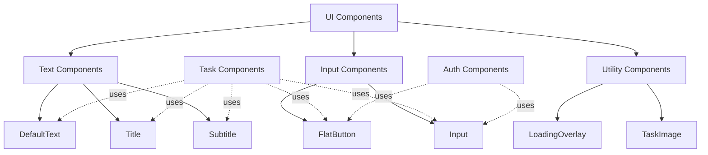

## Overview

UI components are foundational building blocks used throughout the application. They provide consistent styling and behavior for text, buttons, inputs, and other interface elements.

## Text Components

### DefaultText

Basic text component with default app font styling.

**Location**: `src/components/ui/DefaultText.tsx`

<ParamField path="children" type="React.ReactNode" required>
  Text content to display
</ParamField>

<ParamField path="style" type="object">
  Custom style overrides (React Native TextStyle)
</ParamField>

**Usage Example**:

```tsx
import DefaultText from '@/components/ui/DefaultText';

<DefaultText style={{ color: 'gray' }}>
  This is standard body text
</DefaultText>
```

**Default Styles**:
- Font: `appFonts.text`
- Font Size: 14

---

### Title

Large title text component for headings.

**Location**: `src/components/ui/Title.tsx`

<ParamField path="children" type="React.ReactNode" required>
  Title text content
</ParamField>

<ParamField path="style" type="object">
  Custom style overrides (React Native TextStyle)
</ParamField>

**Usage Example**:

```tsx
import Title from '@/components/ui/Title';

<Title style={{ color: 'blue' }}>
  My Tasks
</Title>
```

**Default Styles**:
- Font: `appFonts.title`
- Font Size: 24

---

### Subtitle

Medium-sized subtitle text component.

**Location**: `src/components/ui/Subtitle.tsx`

<ParamField path="children" type="React.ReactNode" required>
  Subtitle text content
</ParamField>

<ParamField path="style" type="object">
  Custom style overrides (React Native TextStyle)
</ParamField>

**Usage Example**:

```tsx
import Subtitle from '@/components/ui/Subtitle';
import { Ionicons } from '@expo/vector-icons';

<Subtitle style={{ fontSize: 12, textAlign: 'right' }}>
  <Ionicons name='calendar-outline' size={12} /> {formattedDate}
</Subtitle>
```

**Default Styles**:
- Font: `appFonts.subtitle`
- Font Size: 18

**Real-world usage**: Used in TaskListElement (line 87-89) to display task creation dates

---

## Input Components

### FlatButton

Pressable button component with text label and optional styling.

**Location**: `src/components/ui/FlatButton.tsx`

**Interface**: `ButtonProps` from `@/interfaces/button`

<ParamField path="children" type="React.ReactNode" required>
  Button label text or icon elements
</ParamField>

<ParamField path="onPress" type="() => void" required>
  Function to execute when button is pressed
</ParamField>

<ParamField path="style" type="object">
  Custom styles object with two properties:
  - `pressableContainer`: Styles for the Pressable wrapper
  - `text`: Styles for the button text
</ParamField>

**Usage Examples**:

<Tabs>
  <Tab title="Basic Button">
    ```tsx
    import FlatButton from '@/components/ui/FlatButton';

    <FlatButton onPress={() => console.log('Clicked')}>
      Click Me
    </FlatButton>
    ```
  </Tab>
  
  <Tab title="With Icon">
    ```tsx
    import FlatButton from '@/components/ui/FlatButton';
    import { Ionicons } from '@expo/vector-icons';

    <FlatButton onPress={handleEdit}>
      <Ionicons name="pencil" size={24} color="#333" />
    </FlatButton>
    ```
    
    From TaskListElement.tsx:104-106
  </Tab>
  
  <Tab title="Custom Styling">
    ```tsx
    import FlatButton from '@/components/ui/FlatButton';

    <FlatButton 
      onPress={toggleStatus}
      style={{
        pressableContainer: {
          backgroundColor: '#FFA500',
          paddingHorizontal: 20,
          paddingVertical: 10,
        },
        text: { color: '#333' },
      }}
    >
      pending
    </FlatButton>
    ```
    
    From TaskListElement.tsx:93-101
  </Tab>
</Tabs>

**Default Styles**:
- Padding: 8
- Font: `appFonts.subtitle`
- Font Size: 16
- Text Align: center
- Pressed Opacity: 0.5

---

### Input

Text input component with label and configurable text input properties.

**Location**: `src/components/ui/Input.tsx`

**Interface**: `InputProps` from `@/interfaces/input`

<ParamField path="label" type="string" required>
  Label text displayed above the input field
</ParamField>

<ParamField path="style" type="object">
  Custom style overrides for the input container
</ParamField>

<ParamField path="textInputConfig" type="TextInputProps">
  React Native TextInput props (value, onChangeText, multiline, placeholder, etc.)
</ParamField>

<ParamField path="invalid" type="boolean">
  Validation state (defined in interface but not currently used)
</ParamField>

**Usage Examples**:

<Tabs>
  <Tab title="Single Line Input">
    ```tsx
    import Input from '@/components/ui/Input';
    import { useState } from 'react';

    const [email, setEmail] = useState('');

    <Input
      label='Email'
      textInputConfig={{
        placeholder: 'Enter an email',
        value: email,
        onChangeText: setEmail
      }}
    />
    ```
    
    From LoginForm.tsx:61-68
  </Tab>
  
  <Tab title="Multiline Input">
    ```tsx
    import Input from '@/components/ui/Input';

    <Input 
      label="Description" 
      textInputConfig={{
        multiline: true,
        autoCapitalize: 'sentences',
        value: inputData.description,
        onChangeText: handleInputChange.bind(this, 'description'),
      }} 
    />
    ```
    
    From TaskForm.tsx:42-49
  </Tab>
</Tabs>

**Styling**:
- Multiline inputs automatically get minimum height of 100 and top text alignment
- Border: 2px bottom border with `GlobalColors.darkBackground`
- Font: `appFonts.text` at size 14
- Label Font: `appFonts.subtitle` at size 12

---

## Utility Components

### LoadingOverlay

Centered loading spinner for async operations.

**Location**: `src/components/ui/LoadingOverlay.tsx`

**Props**: None

**Usage Example**:

```tsx
import LoadingOverlay from '@/components/ui/LoadingOverlay';

{isLoading && <LoadingOverlay />}
```

**Styling**:
- Uses React Native's `ActivityIndicator`
- Color: Blue
- Size: 72
- Centered vertically with `flex: 1`

---

### TaskImage

Displays the goal/task image asset.

**Location**: `src/components/ui/TaskImage.tsx`

**Props**: None

**Usage Example**:

```tsx
import TaskImage from '@/components/ui/TaskImage';

<TaskImage />
```

**Styling**:
- Image Source: `@images/goal.png`
- Dimensions: 120x120
- Margin: 20
- Horizontally centered

---

## Component Relationships



## TypeScript Interfaces

All UI components use TypeScript interfaces from `/src/interfaces/`:

<Accordion title="ButtonProps">
  ```typescript
  // From @/interfaces/button.ts
  type defaultStyleProperty = {[key: string]: string | number | boolean};

  export interface ButtonProps {
    children: React.ReactNode;
    onPress: () => void;
    style?: {
      pressableContainer: defaultStyleProperty;
      text: defaultStyleProperty;
    };
  }
  ```
</Accordion>

<Accordion title="InputProps">
  ```typescript
  // From @/interfaces/input.ts
  export interface InputProps {
    label: string;
    style?: {[key: string]: string | number | boolean};
    textInputConfig?: any;
    invalid?: boolean;
  }
  ```
</Accordion>

<Accordion title="TextProps">
  ```typescript
  // From @/interfaces/text.ts
  export interface TextProps {
    children: React.ReactNode;
    style?: {[key: string]: string | number | boolean};
  }
  ```
</Accordion>

## Best Practices

<Card title="Style Overrides" icon="paintbrush">
  All UI components accept style props that merge with default styles:
  
  ```tsx
  <Title style={{ color: 'blue', marginBottom: 10 }}>
    Custom Title
  </Title>
  ```
  
  Styles are merged using array syntax: `[styles.default, customStyle]`
</Card>

<Card title="Font Consistency" icon="font">
  Components use centralized font definitions from `@/utils/fonts`:
  
  - `appFonts.text` - Body text
  - `appFonts.title` - Large headings
  - `appFonts.subtitle` - Subheadings and buttons
</Card>

<Card title="Accessibility" icon="universal-access">
  When using buttons with icons, consider adding accessible labels:
  
  ```tsx
  <FlatButton 
    onPress={handleDelete}
    accessibilityLabel="Delete task"
  >
    <Ionicons name="trash" size={24} />
  </FlatButton>
  ```
</Card>